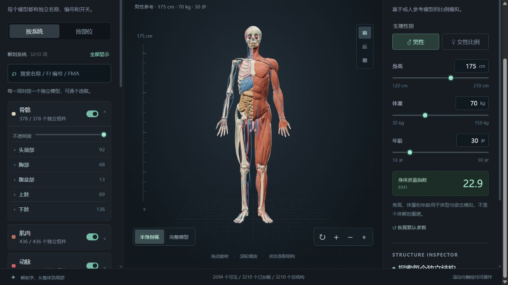

# Anatomy Studio · 人体 3D 解剖工作台

基于 Three.js 与 BodyParts3D 4.3 的交互式人体解剖图谱。支持逐个结构显示、隐藏、检索与聚焦，并提供官方组合关系和身体比例模拟。

**作者：曾铭新（zmx198768） · Wechat:8574157**

- 在线体验：[zengmx.com/anatomy](https://zengmx.com/anatomy/)
- 项目仓库：[zmx198768/anatomy-lab](https://github.com/zmx198768/anatomy-lab)
- [作者信息](AUTHORS.md) · [数据来源及许可](THIRD_PARTY_NOTICES.md) · [开发与数据格式](docs/DEVELOPMENT.md) · [部署说明](docs/DEPLOYMENT.md)



_2026-09-11 部署页面截图。_

## 功能

- 完整导入当前 BodyParts3D 4.3 清单中的 **3,210 个独立网格**，保留 **8,647,172 个三角面**。
- 按 14 个系统分类或头颈、胸部、腹盆部、上肢、下肢浏览。
- 每个组件独立开关；支持系统和区域选择、单项隔离、定位放大。
- 按中文、英文、FJ 模型编号或 FMA 概念编号检索。
- 查看 2,185 个官方组合映射及其已收录的全部成员。
- 支持旋转、缩放、半身剖视、透明度、结构分离、标注和前后侧视角。
- 调整身高、体重、年龄及性别相关比例，查看体型与姿态模拟。
- 21 个压缩模型批次，约 62.89 MB；显示实际加载进度及失败状态。
- 在支持 WebMCP 的环境提供结构查询和批量显示工具；普通浏览器无需此能力。

## 快速运行

运行网页只需要 Python 3 和支持 WebGL、ES Modules、`DecompressionStream` 的现代浏览器。项目已包含 Three.js 和所有压缩模型，无需构建或在线下载模型。

```bash
git clone https://github.com/zmx198768/anatomy-lab.git
cd anatomy-lab
python -m http.server 8080 --bind 127.0.0.1 --directory dist
```

打开 <http://localhost:8080>。不要直接双击 `index.html`，浏览器需要通过 HTTP 加载模块和模型。首次加载会下载约 63 MB 数据，耗时取决于带宽和设备性能。

## 目录

```text
dist/                      可直接部署的静态网页，同时保存可读的前端源码
  index.html               页面结构与 import map
  style.css                页面样式
  atlas-app.js             Three.js 场景、UI 交互和 WebMCP
  atlas-state.js           可见性、检索、区域及组合状态
  atlas-loader.js          分批加载、解压、几何解码和体型变形
  atlas/                   模型批次、索引、组件清单及覆盖报告
  vendor/                  Three.js、OrbitControls 及其 MIT 许可
source-data/
  acquire.py               按官方清单下载原始 OBJ（可选）
  convert.py               OBJ 转换与索引生成（可选）
  official/                官方组成关系与术语清单
  MANIFEST-4.3.csv          原始模型清单
  chinese-reference.json   中文检索参考数据
verify-atlas.mjs            全量数据及状态逻辑校验
verify-loader.mjs           实际模型加载器与变形校验
docs/                      维护、部署与截图说明
```

`dist` 是本项目的正式网页源码目录，并非不可编辑的构建产物。直接修改其中的 HTML、CSS 和应用 JS 即可，不需要重复维护另一套副本。

## 校验与代码格式

使用 Node.js 22 或更新版本：

```bash
npm test
```

校验全部批次的 SHA-256、模型数、三角面和索引，以及单项开关、隔离、区域/系统选择、搜索、组合关系、加载器、有限法线、参数极值和重置行为。测试不需要安装 npm 依赖。

如需统一前端代码格式：

```bash
npm ci
npm run format:check
npm run format
```

Python 数据工具的格式配置见 `pyproject.toml`。重新生成数据的步骤见 [开发说明](docs/DEVELOPMENT.md)。

## 数据范围与限制

“完整”指这份 4.3 清单的全部组件均已导入，不代表人体的每一条微小血管、全部毛细血管、显微组织或个体变异。组件数不等于骨头、血管或器官的实体数量；一个实体可能有多个网格。

基础数据是成人男性参考模型。女性选项仅改变肩髋等外形比例，不包含女性特有器官。身高、体重和年龄仅用于比例及姿态模拟，不构成个体解剖重建或临床测量。中文未匹配的条目保留官方英文名称。

模型经坐标、单位与显示材质转换，以及 16 位位置量化；未删减原始三角面。量化单轴最大误差约 0.014 mm。原始 OBJ 下载缓存不纳入 Git，本仓库直接包含可运行的压缩资源。

## 作者与署名

项目作者与维护者：**曾铭新（GitHub：[@zmx198768](https://github.com/zmx198768)）**。

**Wechat:8574157**

BodyParts3D 模型的原作者为 **The Database Center for Life Science（DBCLS）**，按其官方 **CC BY 4.0** 条款使用；Three.js 按 **MIT** 许可使用。项目作者署名不替代第三方数据与库的原始署名。详见 [第三方说明](THIRD_PARTY_NOTICES.md)。

本仓库尚未为项目自有代码另行授予开源许可；代码使用授权请联系作者。第三方资源继续适用各自的许可。

